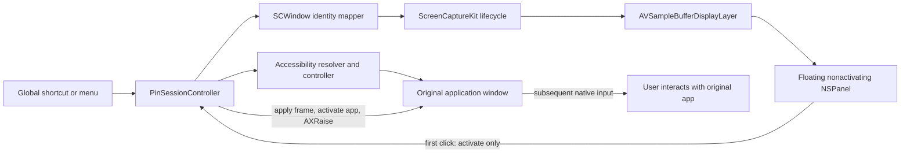

# HaloPin Technical Architecture and Platform-Constraint Report

**Product:** HaloPin v0.1

**Target:** macOS 26 or newer, Apple silicon and 64-bit Intel

**Report date:** July 30, 2026

**Code baseline:** HaloPin v0.1 pre-release working tree

## Executive summary

HaloPin is a menu-bar utility that keeps one selected window visually
available above ordinary application windows. It does not—and, using the
selected public API and security model, cannot—turn another process's original
window into a conventional always-on-top window.

An application such as Calculator controls its own `NSWindow` instances and
can change the behavior or level of those windows internally. HaloPin receives
only an Accessibility representation of another application's window, not its
`NSWindow` object. Public AppKit window-level APIs operate on windows owned by
the calling application; they do not expose a supported cross-process
equivalent. This conclusion is an inference from Apple's public window model
and the APIs available to third-party applications, not a claim about
Calculator's private implementation.

HaloPin therefore uses a hybrid design:

1. The real source window remains native and interactive while its application
   is active.
2. When the source application becomes inactive, HaloPin presents a live
   ScreenCaptureKit image in its own floating panel.
3. Clicking the panel consumes the activating click, positions the real source
   window through Accessibility, activates the source application, raises the
   exact source window, and removes the preview.
4. Passive scrolling validates the exact source window through Accessibility,
   then posts a copied native scroll event directly to the source process
   without activation; all other subsequent interaction occurs directly in
   the original application.

This preserves native text input, selection, menus, drag-and-drop,
accessibility behavior, and application-specific controls without general
input synthesis. Scroll-wheel events are the narrow exception: HaloPin maps
their location into the original window, resolves a scrollable descendant only
within the pinned `AXWindow`, and sends the copied event to the source PID.
Accessibility scrollbar actions remain a fallback when a native event is not
available.
The unavoidable compromise is that the first preview click activates the real
window but does not also activate the control beneath the pointer.

System Integrity Protection (SIP) remains fully enabled. SIP is relevant
because it protects system components and helps prevent unsupported injection
or modification techniques, but it is not the only—or even the immediate—limit
on foreign-window pinning. Window ownership, WindowServer policy, TCC privacy
controls, App Sandbox restrictions, application rendering behavior, and the
public Spaces API are separate constraints.

## Product boundary

HaloPin provides:

- one pinned window per session;
- a configurable global shortcut;
- an always-visible passive preview owned by HaloPin;
- native interaction after preview-to-source handoff;
- optional native source resizing and movement after passive gestures;
- a temporary pin halo, pin sound, and distinct intentional-unpin sound;
- best-effort behavior across Spaces and supported fullscreen Spaces;
- local, memory-only capture with no audio, storage, analytics, or network use.

HaloPin does not provide:

- a cross-process equivalent of setting `NSWindow.level`;
- general interaction directly inside the captured preview beyond scrolling;
- automated reassignment of another application's windows between Spaces;
- automatic control of the Dock's **Assign To → All Desktops** setting;
- private WindowServer, SkyLight, or CoreGraphics Services integration;
- process injection, a privileged helper, root access, or reduced SIP;
- synthetic click or keyboard replay;
- capture of protected or DRM content;
- pin restoration after either application restarts.

## Why the architecture is hybrid

### Window ownership is the primary functional constraint

An `NSWindow` represents a window displayed by an application and distributes
input to that application's views. HaloPin can create and raise its own
`NSPanel`, but it cannot obtain another application's actual `NSWindow`
instance. Accessibility exposes a controlled, cross-process automation
surface—attributes such as position and size, plus actions such as
`AXRaise`—not the source application's AppKit object graph.

Apple documents `NSWindow` as the window an app displays and documents
Accessibility actions as requests that may be unsupported, invalid, or unable
to complete. These semantics explain two important design choices:

- the passive always-on-top surface must be a HaloPin-owned panel; and
- Accessibility results must be read back and treated as authoritative rather
  than assuming a requested operation succeeded exactly.

See [NSWindow](https://developer.apple.com/documentation/appkit/nswindow) and
[AXUIElementPerformAction](https://developer.apple.com/documentation/applicationservices/1462091-axuielementperformaction).

### SIP is a security boundary, not a feature API

SIP uses mandatory access controls to protect critical system locations and
restrict actions even for root processes. On Apple silicon it complements
additional kernel integrity protections. Disabling SIP could make some
unsupported code-injection or system-modification experiments possible, but
it would not create a documented API for changing another application's window
level. It would exchange a product limitation for a system-wide security
reduction and a fragile dependency on implementation details.

HaloPin deliberately rejects that trade:

- SIP stays enabled;
- no code is injected into the source process or Dock;
- no protected system component is modified;
- no private WindowServer or SkyLight symbol is called;
- installation does not require Recovery mode, administrator access, or a
  privileged helper.

Apple's description of SIP is available in
[About System Integrity Protection](https://support.apple.com/en-us/102149)
and the
[Apple Platform Security guide](https://support.apple.com/guide/security/system-integrity-protection-secb7ea06b49/web).

### TCC provides explicit user consent

HaloPin crosses two privacy boundaries through supported APIs:

- **Accessibility** permits focused-window discovery, frame reads and writes,
  `AXRaise`, and lifecycle observation.
- **Screen Recording** permits ScreenCaptureKit to produce the selected
  window's preview.

The permissions are independent. Accessibility cannot supply pixels, and
Screen Recording cannot move, resize, raise, or activate the source window.
Revoking either permission ends the pin session and removes the overlay.

TCC associates grants with application identity. A stable bundle identifier
and Developer ID signature are consequently part of runtime correctness, not
just release polish. Ad-hoc development builds can retain permission across
ordinary restarts of the same binary, but rebuilding changes their identity
and may require the grants again.

### App Sandbox is not enabled

The app uses Hardened Runtime but has an empty entitlement file; it does not
enable `com.apple.security.app-sandbox`. Apple's App Sandbox documentation
lists use of Accessibility APIs in assistive applications among activities
that are incompatible with the sandbox. The direct-distribution build accepts
the reduced containment of an unsandboxed process so it can perform its core
cross-application Accessibility work.

This is a meaningful security compromise, mitigated by:

- an empty Hardened Runtime exception set;
- no network client or server;
- no analytics or updater;
- no arbitrary file access workflow;
- no plug-in loading;
- no privileged helper;
- no executable-memory, library-validation, or injection exceptions;
- local, window-filtered, memory-only capture.

See
[Protecting user data with App Sandbox](https://developer.apple.com/documentation/security/protecting-user-data-with-app-sandbox),
[Configuring the macOS App Sandbox](https://developer.apple.com/documentation/xcode/configuring-the-macos-app-sandbox),
and [Hardened Runtime](https://developer.apple.com/documentation/security/hardened-runtime).

## System architecture

All product-state changes pass through the main-actor
`PinSessionController`. Protocol-backed services isolate permissions, shortcut
registration, Accessibility, window identity, capture, preview presentation,
workspace events, and feedback. The principal session states are:

`resolving → interactive → becomingPassive → passive → handingOff → interactive`

Failure and termination transitions are validated by a state-transition table.
Asynchronous geometry and Space-recovery operations use revision counters so a
stale task cannot overwrite a newer request.

### Main components

| Component | Responsibility |
| --- | --- |
| `AppDelegate` / `StatusItemController` | Accessory-app lifecycle, menu-bar UI, settings, and menu commands |
| `GlobalShortcutManager` | Carbon global hot-key registration, conflict detection, and persistence |
| `PermissionCoordinator` | TCC preflight, one-time prompts, and System Settings routing |
| `FocusedWindowResolver` | Resolves and validates the frontmost Accessibility window |
| `ScreenCaptureWindowIdentityMapper` | Maps the AX window to an `SCWindow`, then refreshes only the exact PID/window ID |
| `AccessibilityWindowController` | Reads/applies frames, performs `AXRaise`, and verifies the exact focused window |
| `CaptureLifecycleCoordinator` | Serializes capture modes, restarts, preserved-frame pauses, and cleanup |
| `ScreenCaptureEngine` | Configures `SCStream`, classifies frames, renders complete frames, and monitors health |
| `PreviewPanelController` | Owns the floating panel, rounded clipping, gestures, guidance, frozen frames, and fade transitions |
| `WorkspaceObserver` / `AXWindowObserver` | Normalizes application, Space, screen, sleep, termination, and source-window events |
| `FeedbackPresenter` | Halo, synthesized sounds, HUD errors, and accessibility announcements |

## Window selection and identity

The selected window is resolved from the frontmost regular application through
Accessibility. HaloPin rejects itself, missing focused windows, system dialogs,
minimized windows, fullscreen windows, and unusably small windows.

Accessibility elements and ScreenCaptureKit windows use different identity
systems. Initial mapping therefore scores candidates from the same PID using:

- frame similarity;
- title equality when available;
- front-to-back order as a small tie-breaker.

After the initial match, the `CGWindowID` and owner PID become the session
identity. Every recovery requires that exact pair. HaloPin never silently
retargets a similarly titled window if the source disappears.

This avoids a dangerous usability failure—showing or activating the wrong
document—but means closing and recreating a visually identical source window
terminates the pin.

## Capture and rendering

ScreenCaptureKit filters capture to the selected window. When one display
fully contains the window, HaloPin uses a display-scoped filter including only
that `SCWindow` and a display-relative source rectangle. If a window spans
displays, it falls back to `SCContentFilter(desktopIndependentWindow:)` to
avoid reconstructing a partial window. Apple documents that initializer as
capturing only the specified window:
[SCContentFilter](https://developer.apple.com/documentation/screencapturekit/sccontentfilter)
and
[`init(desktopIndependentWindow:)`](https://developer.apple.com/documentation/screencapturekit/sccontentfilter/init%28desktopindependentwindow%3A%29).

The stream uses:

- BGRA pixel buffers in sRGB;
- no cursor;
- no audio;
- aspect-preserving scaling;
- queue depth 1 in warm mode and 2 in live mode;
- 1 fps with a 1,280-pixel longest-edge cap in warm mode;
- 30 fps at the required native pixel dimensions in live mode.

Only `.complete` ScreenCaptureKit samples are displayed or counted as fresh
content. `.idle` and `.started` samples count only as transport heartbeats;
blank, suspended, stopped, unknown, or superseded-stream samples are ignored.
This distinction prevents a live stream that is returning no new pixels from
being mistaken for a visually fresh preview.

Capture generations are lock-protected. Complete-frame waits use continuations
instead of polling, and stale stream callbacks cannot render into the current
session. A watchdog exists only while a passive live preview is visible. Fully
unpinned HaloPin has no capture stream, workspace observer, AX observer, or
repeating stall timer.

## Passive preview

The preview is a borderless, resizable, nonactivating `NSPanel` owned by
HaloPin. It is:

- level `.floating`;
- unable to become key or main;
- visible without activating HaloPin;
- configured with `.canJoinAllSpaces`, `.fullScreenAuxiliary`,
  `.stationary`, and `.ignoresCycle`;
- clipped to a 12-point continuous corner radius;
- movable from its small external handle and resizable from its edges.

Apple documents `canJoinAllSpaces` as allowing the window to appear in all
Spaces and `fullScreenAuxiliary` as allowing it to display alongside a
fullscreen window. These behaviors apply to HaloPin's own panel, not to the
foreign source window. See
[NSWindow.CollectionBehavior](https://developer.apple.com/documentation/appkit/nswindow/collectionbehavior-swift.struct)
and
[`canJoinAllSpaces`](https://developer.apple.com/documentation/appkit/nswindow/collectionbehavior-swift.struct/canjoinallspaces).

The fixed 12-point corner is a visual approximation. The capture API does not
provide every application's actual window-corner mask, and applications may
use different chrome, custom shapes, or future system standards.

## Native handoff

Clicking captured content performs the following bounded operation:

1. Consume the click and freeze the preview.
2. Apply the preview's complete frame to the AX window.
3. Read back the frame accepted by the source application.
4. Reconcile the preview if the application enforced placement or size limits.
5. Activate the source `NSRunningApplication`.
6. Perform `AXRaise` on the exact AX window.
7. Wait until the application is active and that exact window is focused.
8. Retry `AXRaise` once if needed.
9. Fade out the preview and return capture to warm mode.

The pointer is not moved and the original click is not replayed. Replaying it
would require synthetic input and could trigger the wrong control after a
Space transition, delayed layout, or source-enforced frame change. The
activation-only first click is therefore a deliberate safety and correctness
compromise.

Passive scrolling does not perform this handoff. HaloPin copies the native
mouse-wheel or trackpad `CGEvent`, maps its location into the source window's
current frame, and searches only the pinned `AXWindow` hierarchy for the
deepest scrollable element under that point. Once validated, the copied event
is posted directly to the source PID, preserving horizontal and vertical
deltas, modifiers, precision, phases, and momentum. If no native event is
available, exposed `AXScrollBar` increment/decrement actions and writable
values provide a semantic fallback. Other mouse and keyboard events are never
forwarded.

## Passive geometry synchronization

Moving or resizing the preview remains locally responsive during the gesture.
On release, if native geometry synchronization is enabled, HaloPin applies the
full preview frame to the inactive source window through Accessibility.

The source application remains authoritative:

- HaloPin polls until the AX frame stabilizes or a 120 ms bound expires.
- The accepted frame replaces both source and preview geometry.
- The capture output is reconfigured only after the accepted native geometry
  is known.
- The previous displayed frame remains visible while fresh frames arrive.

If the application rejects the operation, HaloPin retains the user's preview
frame and falls back to scaled video for that gesture. This is required because
Accessibility support varies and applications may enforce fixed size,
minimum/maximum size, aspect ratio, screen bounds, or custom placement rules.

## Spaces, desktops, and Stage Manager

Cross-Space behavior is the largest remaining functional compromise.

HaloPin can place its own panel on all Spaces, but no selected public API moves
another application's exact window to the active Space or changes the Dock's
app-wide Desktop assignment. Forcing such behavior would require private APIs,
Dock preference modification, Mission Control automation, or synthetic input.

After a Space change HaloPin:

1. debounces the notification;
2. refreshes the exact `CGWindowID` and PID;
3. treats `SCWindow.isOnScreen || SCWindow.isActive` as capture-eligible;
4. rebuilds live capture and requires fresh complete frames;
5. preserves the last displayed image during recovery.

Some applications stop continuously rendering an off-Space window even when a
capture stream remains technically alive. In that case HaloPin stops the
stream, dims the preserved image, and reports **Off Desktop — Paused** rather
than presenting stale pixels as live.

The user may assign the entire source application to **All Desktops** through
the Dock and ask HaloPin to retry. This can restore continuous rendering, but
it affects every window owned by that application. If the user declines, the
paused preview remains movable, resizable, unpinnable, and usable for
click-to-handoff; handoff may switch to the source window's original Space.

## Constraint and compromise matrix

| Constraint | Product compromise | Why it was accepted |
| --- | --- | --- |
| No public foreign-window-level control | HaloPin floats its own captured panel | Keeps SIP enabled and avoids injection/private APIs |
| Preview pixels are not the source UI | First click performs handoff; later input is native | Avoids inaccurate or dangerous input forwarding |
| Accessibility is cooperative | Requested frames are read back and may snap or fail | Respects application constraints and supported AX semantics |
| Spaces APIs control HaloPin's panel, not foreign windows | Off-Space guidance, paused fallback, possible Space switch on handoff | Avoids private Space manipulation |
| Source apps may stop rendering off-Space | Preserve the last frame and label it paused | Never claims stale content is live |
| Screen capture is privacy-protected | Screen Recording consent is mandatory | Uses Apple's supported capture boundary |
| Cross-app window control is privacy-protected | Accessibility consent is mandatory | Uses the narrow supported control surface |
| Accessibility assistive behavior conflicts with App Sandbox | Direct-distribution build is unsandboxed | Core functionality otherwise cannot operate |
| Protected content blocks capture | Pin request fails; no bypass | Preserves DRM and platform security |
| Window shape is not exposed consistently | One 12-point continuous preview corner | Predictable visual treatment with imperfect per-app fidelity |
| A source application is the activation boundary | Preview hides while any source-app window is active | Version 1 avoids unreliable intra-app focus arbitration |
| Window IDs and AX references are session-specific | No pin restoration after restart | Prevents stale or incorrect retargeting |
| Broad compatibility increases state complexity | One pinned window in version 1 | Keeps recovery and cleanup deterministic |
| Direct downloads meet Gatekeeper | Developer ID, Hardened Runtime, notarization, and stapling required | Standard secure distribution path outside the App Store |

## Security and privacy posture

HaloPin's security contract is:

- SIP fully enabled;
- Hardened Runtime enabled;
- no Hardened Runtime exception entitlements;
- no root process or privileged helper;
- no process or library injection;
- no private frameworks;
- no virtual display;
- no synthetic input;
- no audio capture;
- no captured frame, title, coordinate, or activity persistence;
- no network requests, analytics, updater, or telemetry;
- privacy-redacted unified logging;
- exact-window filtering and identity;
- final cleanup flushes the displayed image.

The highest-risk permissions are still substantial:

- Accessibility can observe and manipulate UI across applications.
- Screen Recording can expose sensitive on-screen content.

The minimal code surface, no-network policy, no stored frames, stable signing,
and explicit permission UX reduce—but do not eliminate—the consequences of a
future vulnerability. The absence of App Sandbox makes secure coding,
dependency restraint, signing-key protection, and reproducible release review
particularly important.

## Distribution status and compromise

The project supports a universal `arm64`/`x86_64` app with Hardened Runtime,
Developer ID signing, DMG creation, `notarytool` submission, ticket stapling,
and validation. Apple requires Developer ID, Hardened Runtime, and valid
signatures for notarized direct distribution. Notarization scans for malicious
content and signing problems; it is not App Review. See
[Notarizing macOS software before distribution](https://developer.apple.com/documentation/security/notarizing-macos-software-before-distribution)
and
[Gatekeeper and runtime protection](https://support.apple.com/guide/security/gatekeeper-and-runtime-protection-sec5599b66df/web).

At the time of this report, the locally generated `outputs/HaloPin.app` is
universal and Hardened Runtime enabled but ad-hoc signed:

- identifier: `com.halopin.HaloPin`;
- architectures: `x86_64` and `arm64`;
- code-signing flags: `adhoc,runtime`;
- Developer Team identifier: absent.

That artifact is suitable for local development and testing, not the intended
public release. A public build must use a stable Developer ID Application
identity, include a secure timestamp, be notarized, and have the ticket stapled
and validated. Until that occurs, Gatekeeper may require a deliberate local
override and TCC grants may not survive rebuilds reliably.

## Performance and lifecycle decisions

The original always-live capture design was simplified into three operational
modes:

| Mode | Capture behavior | Purpose |
| --- | --- | --- |
| Unpinned / stopped | No stream or session observers | Negligible idle work |
| Interactive / warm | 1 fps, queue depth 1, longest edge capped at 1,280 px | Fast passive return without full live-capture cost |
| Passive / live | 30 fps, queue depth 2, native required resolution | Full visible-preview quality |
| Off-Space / suspended | Stream stopped, last image retained where appropriate | No useless recovery loop or capture cost |

Capture health callbacks are emitted only on state transitions. Complete-frame
waits use continuations, cleanup is serialized, and stream generations prevent
a delayed stop or callback from affecting a replacement stream.

This design preserves visible passive quality while reducing background CPU,
memory pressure, frame queueing, and main-actor wakeups. Exact CPU and memory
figures remain hardware-, display-, and source-dependent and should be measured
with Instruments on release hardware.

## Failure policy

HaloPin favors visible failure over unsafe fallback:

- source close or process termination: automatic silent unpin;
- minimize, hide, or native fullscreen: automatic unpin with explanation;
- permission revocation: stop capture, remove preview, and unpin;
- protected content: reject the pin;
- AX frame rejection: retain a scaled preview and show one concise HUD;
- activation failure: retry raise once, then restore passive mode;
- off-Space unavailability: preserve and mark the frame paused;
- sleep or inactive login session: suspend capture and revalidate on resume;
- display removal: clamp the preview to a remaining visible display;
- exact window ID disappearance: terminate rather than retarget.

Automatic cleanup is silent. Only an intentional shortcut, menu, or explicit
UI unpin plays the unpin sound, and only when a real session exists.

## Testing status

The test suite covers:

- the complete state-transition table;
- candidate matching and exact-window non-retargeting;
- coordinate conversion;
- warm/live capture configuration;
- frame-status classification;
- capture health coalescing and continuation-based waits;
- serialized capture replacement and stop behavior;
- native passive geometry synchronization and fallback;
- cross-Space recovery, guidance, and cancellation;
- intentional versus automatic unpin feedback;
- observer and capture inactivity while unpinned.

On July 30, 2026, a clean scratch build executed **43 tests with 0 failures**.
The repository also contains an integration fixture for standard, constrained,
duplicate-title, WebKit, sheet, and modal windows. Unit tests do not replace
manual validation of ScreenCaptureKit, Spaces, Stage Manager, DRM, TCC,
multiple displays, or source-application rendering behavior.

## Rejected alternatives

### Disable or partially disable SIP

Rejected because it weakens a machine-wide protection, complicates
installation, is unsuitable for normal distribution, and still does not
produce a stable public cross-process window-level API.

### Inject code into the source application

Potentially capable of changing a native window from inside the owning process,
but rejected because it conflicts with process integrity, Hardened Runtime,
code signing, compatibility, and the security contract.

### Use private SkyLight, CoreGraphics Services, or WindowServer APIs

Rejected because private contracts can change without notice, may fail across
OS releases, are unsuitable for notarized product guarantees, and could
interfere with Spaces or system stability.

### Forward mouse and keyboard input to the preview

Rejected because coordinate translation, control hit-testing, menus, secure
input, drag-and-drop, accessibility, Space transitions, and application
latency cannot be reproduced reliably. It would also require broader event
control and create accidental-action risk.

### Use a virtual display or full-display capture

Rejected because it changes the user's display topology, increases capture
scope and resource use, does not make the original window native in the
preview, and adds privacy and compatibility risk.

### Automate Mission Control or Dock assignment

Rejected because it would rely on synthetic interaction or private state,
could rearrange the user's workspaces, and the All Desktops setting applies to
the entire application rather than one selected window.

### Add a privileged helper

Rejected because root privilege does not grant ownership of another
application's `NSWindow` or create a supported Space-control API. It would add
significant installation and attack surface without solving the core problem.

## Residual risks and recommendations

1. **Complete release signing and notarization.** The current local artifact is
   ad-hoc signed and should not be described as production-distributable.
2. **Pin the CI toolchain and use clean build caches.** Swift and SDK module
   caches are compiler-specific; release verification should use an isolated
   scratch path.
3. **Keep a manual cross-Space compatibility matrix.** ScreenCaptureKit stream
   health and source rendering remain application- and OS-dependent.
4. **Revisit Stage Manager collection behavior on final macOS releases.**
   Apple documents that some collection behaviors are mutually exclusive and
   their effects vary across window-management technologies.
5. **Audit Accessibility scope regularly.** It is the most powerful permission
   in the product and the reason the direct build is not sandboxed.
6. **Maintain exact identity matching.** Convenience retargeting would risk
   showing or activating the wrong user's document.
7. **Avoid adding network code without a new threat model.** The current
   no-network design materially limits the impact of captured sensitive data.
8. **Consider cooperative integration as the only path to true native
   pinning.** A source application that adopts its own plug-in, extension, or
   documented HaloPin protocol could change its own window level. That would
   be application-specific, not a universal utility.
9. **Adopt any future public system API if Apple exposes one.** A supported
   foreign-window pinning or per-window Space-assignment API could replace the
   hybrid model without weakening security.

## Conclusion

HaloPin's central compromise is intentional: it trades seamless interaction
inside an always-on-top foreign window for a secure, public-API design that
keeps SIP enabled and returns the user to the original native application for
interaction.

The result is not equivalent to Calculator's internally owned “Keep on Top”
window. It is a controlled approximation with strong native-interaction
fidelity after handoff, explicit privacy permissions, exact window identity,
honest stale-frame handling, and no system modification. Within current public
macOS constraints, the hybrid preview-to-original architecture is the most
defensible balance between functionality, security, compatibility, and
distribution viability.
